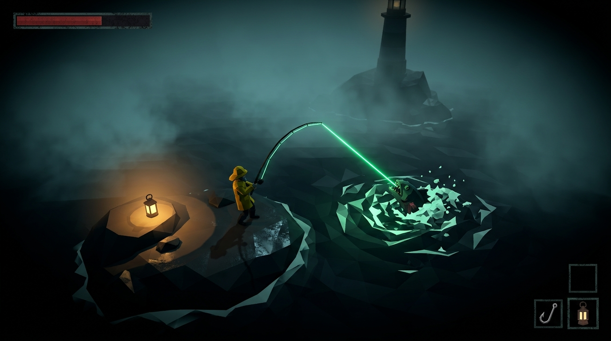

# UNDERTOW

*A fishing roguelite ARPG about catching what you drowned.*

**Hades' combat, Dredge's dread, and a fishing line that works both ways.**



You are the last keeper of a drowned lighthouse on a black lake with no
bottom. Something at the bottom accepts tribute: for every catch you
deliver, it returns a piece of the town you flooded — a building, a bell,
a person. The catch: the fish *are* the townsfolk.

**Signature mechanic:** fishing IS combat. Hooking a catch tethers it to
you — a physical line constraint neither of you can break for free. Every
fight is a leash fight.

## Status

| Milestone | | |
|---|---|---|
| M0 The Look | ✅ | Night lake, Gerstner water, fog, lantern, rowable boat |
| M1 The Fight | ✅ | On-foot combat: dodge, stamina, gaff combo, first fish (automated fight-gate verified) |
| M1.5 Asset pipeline | ✅ | Tripo3D + Blender → GLTF; keeper/rowboat/lighthouse/rocks in-game |
| M2 The Line | ✅ | Tether combat: constraint, reel/brace/snap/cut, fish AI, water phase, line render — six-scenario automated gate passing (human feel-pass pending) |
| M3 The Loop | 🔨 | Playable run loop: cast/SET/fight/land, Dread, night clock, extraction receipts, saves (boat combat + descents remain) |
| M3–M10 | — | Run loop, fish generator, town, zones, endings ([docs/plan](docs/plan/00-overview.md)) |

## Quickstart

```bash
npm install
npm run dev        # http://localhost:5173  (?debug for perf overlay, ?mode=foot for land)
```

| Key | Action |
|---|---|
| WASD / arrows | Move (row the boat / walk) |
| Space | Dodge roll (on foot) |
| LMB tap / hold | Gaff light combo / heavy |
| B | Toggle boat ↔ foot (debug) |

## Development

```bash
npm test           # unit suite (vitest, pure-logic systems)
npm run smoke      # boots the real app headless; fails on console errors / black frame
node tools/fight.mjs   # automated M1 fight gate (Playwright plays the game)
npx tsc --noEmit   # typecheck
```

- **Architecture:** TypeScript + Three.js + Vite, no backend. ECS-lite:
  plain data structs, systems as pure functions in a fixed update order,
  deterministic fixed-timestep sim (seeded PCG32). Game logic imports no
  Three — the whole sim runs headless in Node for tests.
- **Assets:** hybrid — hero props/characters generated via Tripo3D and
  prepped in headless Blender ([docs/plan/07-assets.md](docs/plan/07-assets.md));
  the ~60 fish species stay fully procedural (one parameterized rig).
  Concept art bible in [docs/concepts/images](docs/concepts/images/).
- **Design spec:** [plan.md](plan.md) · **Implementation plans:**
  [docs/plan/](docs/plan/00-overview.md) · **Testing:**
  [docs/plan/06-testing.md](docs/plan/06-testing.md)

## Tooling

Three.js · Vite · Vitest · Playwright · Tripo3D · Blender (headless) ·
Tone.js (audio, planned) · built by a small fleet of AI coding agents
orchestrated with [wt](docs/plan/00-overview.md).
