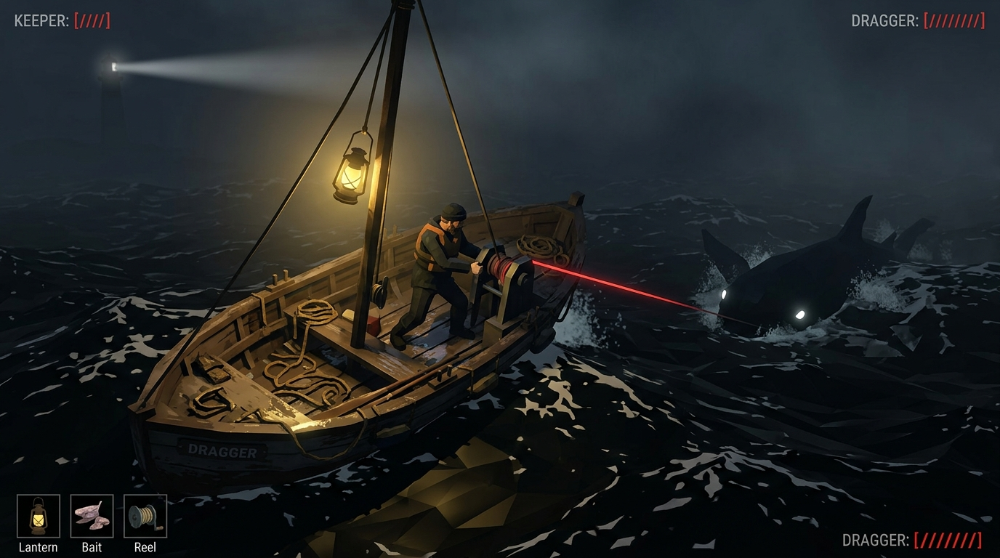
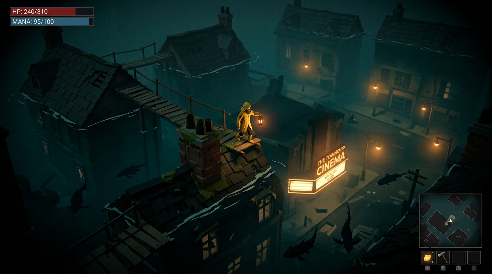
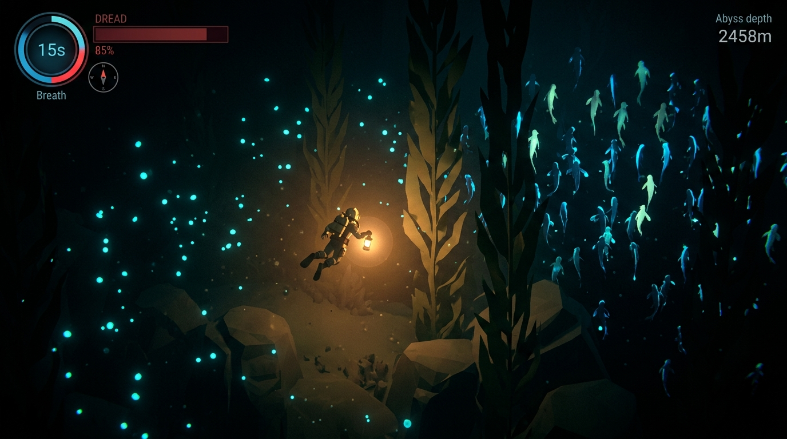
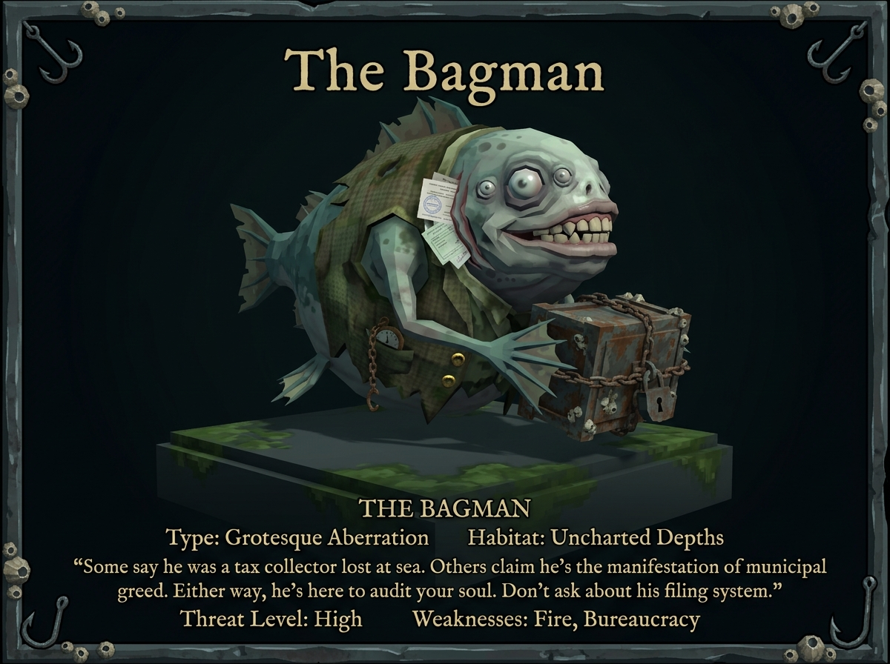
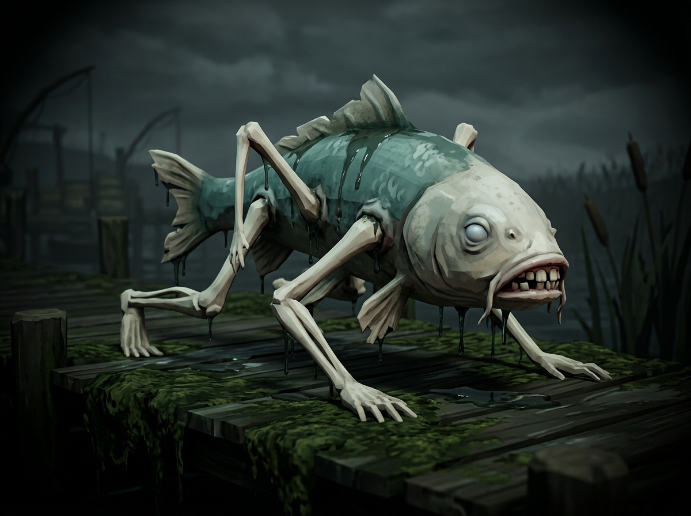
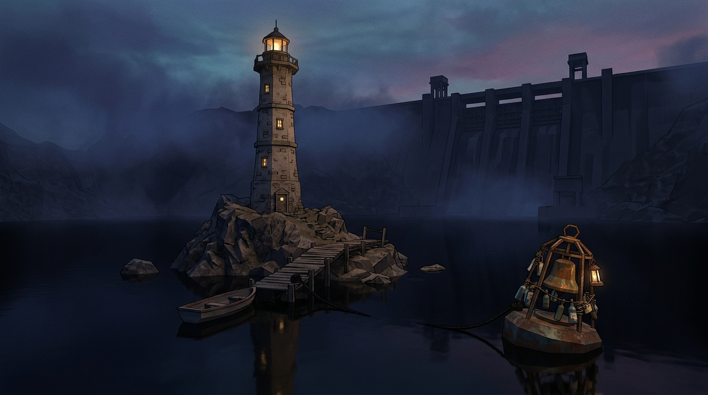
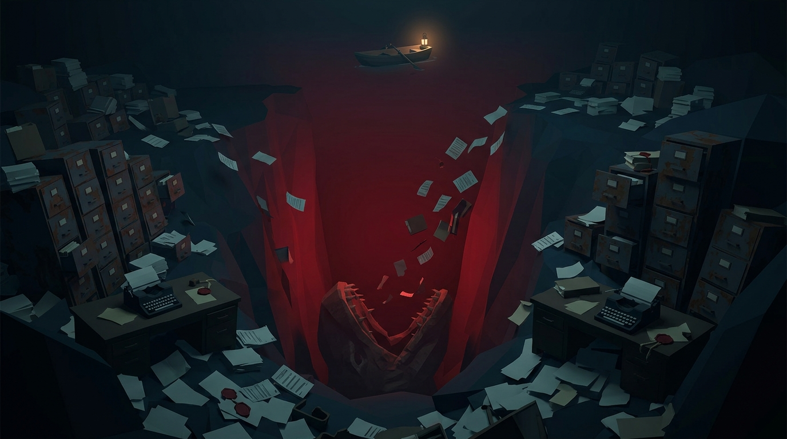

# UNDERTOW — Progress Report & Visual Concept Art

*A fishing roguelite ARPG about catching what you drowned.*

---

## 1. Project Progress Summary

Based on [plan.md](../../plan.md) and the technical milestone ladder in [00-overview.md](../plan/00-overview.md), here is the current development progress:

### Milestone Status Breakdown

| Milestone | Scope & Deliverables | Status | Details / Implemented Files |
| :--- | :--- | :---: | :--- |
| **M0: The Look** | Vite + TS + Three.js scaffold, Gerstner water shader + depth gradient, volumetric fog (`FogExp2`), pulsing point lantern, rowable boat kinematics, fixed-timestep ECS-lite loop. | <mark>**COMPLETE**</mark> | [`src/render/water.ts`](../../src/render/water.ts), [`src/render/sky.ts`](../../src/render/sky.ts), [`src/render/lantern.ts`](../../src/render/lantern.ts), [`src/game/boat.ts`](../../src/game/boat.ts), [`src/core/world.ts`](../../src/core/world.ts) |
| **M1: The Fight** | 8-direction top-down on-foot controller, dodge-roll with i-frames (0.25s / 0.6s CD / 25 stamina), stamina pool & regen delay, 3-hit gaff combo + heavy wind-up, hardcoded sine-spine fish with AI states (strafe, lunge, hurt, recover), 117 unit tests. | <mark>**COMPLETE**</mark> | [`src/game/controller.ts`](../../src/game/controller.ts), [`src/game/stamina.ts`](../../src/game/stamina.ts), [`src/game/combat.ts`](../../src/game/combat.ts), [`src/game/fish.ts`](../../src/game/fish.ts), [`tests/`](../../tests) (117 passing tests) |
| **M2: The Line (Fun-or-Dead Gate)** | Tether distance constraint, line tension physics ($0\dots100$), reel stance (RMB), fish lunges/drag impulse transfer, brace mechanic, line snap, cut line (F), exhaustion & clean catch LAND prompt, water phase transition. | <mark>**NEXT UP**</mark> | Specification complete in [`docs/plan/02-tether.md`](../plan/02-tether.md). |
| **M3: The Loop** | Seeded PCG32 surface maps (islet graph via Poisson-disc + Delaunay), disturbances, bite SET/RELEASE, Dread economy ($0\dots100$), Night Clock phases, extraction buoy, death condolence rate (30%), IndexedDB + Zod save state. | **PLANNED** | Detailed in [`docs/plan/03-runloop.md`](../plan/03-runloop.md). |
| **M4: The Fish** | Procedural `FishParams` mesh generator (shared topology pool), sine-spine & limb animation, wrongness curve lerp, 12 Shallows species, bestiary UI, loot/affix generator, Keeper's License. | **PLANNED** | Detailed in [`docs/plan/04-fish-and-loot.md`](../plan/04-fish-and-loot.md). |
| **M5: The Town** | Lighthouse hub, 6 restorable buildings (+2 starting Dread per building), rod classes, NPC barks, bottle notes, vertical slice complete (Shallows + Old Pike boss). | **PLANNED** | Detailed in [`docs/plan/05-meta-and-content.md`](../plan/05-meta-and-content.md). |
| **M6–M9: Deep Zones & Bosses** | Kelp Graves (The Congregation), The Township (The Postmaster), The Choir (Maren's Echo), The Mouth (The Office of Returns). | **PLANNED** | Detailed in spec §7 & §10. |
| **M10: The End** | Endings A (HAUL) & B (CUT), Maren breadcrumbs, Drowned unique items, procedural Tone.js audio system. | **PLANNED** | Detailed in spec §2.5 & §11. |

---

## 2. In-Game Screenshots Concept Gallery

Visual concept renders reflecting the flat-shaded, low-poly aesthetic (`MeshLambertMaterial`, vertex colours, zero textures, volumetric `FogExp2`, dark bone-teal palettes, and sodium-amber lighting).

### 2.1 The Tether Combat (Land & Shallows)

The signature mechanic: fishing IS combat. A physical line constraint where both you and the hooked catch are locked on a leash.

> [!NOTE]
> **Key Mechanics Shown:**
> - **Quadratic Bézier Line:** Dynamic colour tension indicator (green $\rightarrow$ white $\rightarrow$ red).
> - **Top-down 8-direction combat:** Keeper bracing on wet islets while reeling or gaffing.
> - **Lighting & Atmosphere:** Point lantern lighting cutting through dense bone-teal fog.

---

### 2.2 Night Phase & Boat Combat

During the Night Clock phases, massive leviathans (**Draggers**) can hook the boat itself, initiating high-stakes boat-scale tether combat.

> [!TIP]
> **Night Clock Mechanics:**
> - **Winch Post Reeling:** Keeper holds the mechanical winch to haul in Draggers.
> - **High Tension Risk:** Cutting the line costs a hull segment; letting hull reach 0 swamps the boat into an emergency water phase.

---

### 2.3 The Drowned Township (Zone 3)

The flooded ruins of Greywater Hollow. Walkable rooftops, flooded attic windows, and vintage sodium streetlights still burning under pitch-black water.

---

### 2.4 The Choir Abyss & Water Phase (Zone 4)

Dragged past the shoreline or swamped into the depths: the water phase introduces a 15-second breath meter in a bioluminescent abyss.

---

## 3. Bestiary & Procedural Creature Concepts

Every creature in *Undertow* is generated from the same procedural rig (`FishParams`), with parameters shifting toward uncanny human proportions as you descend deeper into the lake.

### The Bagman (Rare Run Event)
A bloated courier fish wearing the remains of a Victorian municipal waistcoat, hauling one of the Office's strongboxes. It sprints directly for the nearest sinkhole—hooking it turns the fight into a high-speed waterskiing chase.

### The Crawler (Land Ambush)
Parameterised with increased `limbBudget` and `humanRatio`, developing spindly human-like limbs to haul itself onto docks when local Dread rises.

---

## 4. World & Climax Concepts

### The Lighthouse Hub (Dusk)
The solitary inland stone lighthouse, the bell buoy where tribute is delivered, the moored rowboat, and the colossal concrete spillway dam looming in the distance.

### The Mouth / The Office of Returns (Zone 5 Climax)
The bottom of the lake where water turns crimson red, surrounded by endless cascades of waterlogged municipal filing cabinets, vintage typewriters, and stamped receipts.

